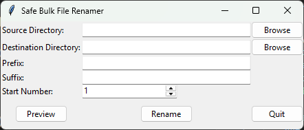

# Safe Bulk File Renamer

A safe and easy-to-use desktop app for renaming hundreds of files at once.

## Features
- Preview changes before committing
- Modern GUI with themed widgets
- Safety checks to prevent overwrites
- Customizable naming patterns with counters

## Usage
1. Run the application: `python renamer_app.py`
2. Select a folder containing files to rename
3. Enter a naming pattern (must include `####` as a number placeholder)
4. Set the starting number
5. Preview the changes
6. Commit the rename when ready

## Installation
No installation required - just Python 3 and Tkinter